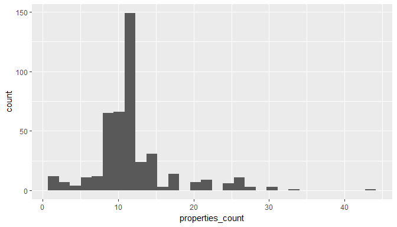
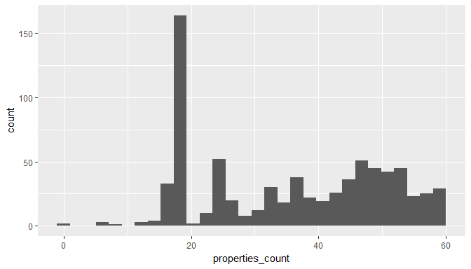

Explortion des données smartphones
================

Objectif du document
--------------------

L'objectif du document est l'exploration des datasets "SMARTPHONES". Ces données proviennent de deux retailers : **Rue du Commerce** et **Amazon**. Le but étant de savoir si l'on peut aisément appliquer la méthode *Vincent Gigliobianco*. Méthode servant à extraire les différentes entités composant le label d'un produit. Les données se composent de quatre datasets provenant des deux retailers Amazon et Rue du commerce. Pour chacun des retailers, il existe un datset *properties* et un dataset *description*.

``` r
rdsfiles = list.files(path = folderdata,pattern = "*.rds",full.names = T)
amazon_description = readRDS(file = rdsfiles[1])
amazon_property = readRDS(file = rdsfiles[2])
rdc_description = readRDS(file = rdsfiles[3])
rdc_property = readRDS(file = rdsfiles[4])
```

Amazon
------

#### Description Dataset

Le dataset contient **296** lignes. Le dataset contient 296 identifiants uniques.

| id         | rayon     | produit                             | description                                                                                                                                                                                                                                                                                                                                                                                                                                                                                                                                                                                                                                                                                                                                                                                                                                            |
|:-----------|:----------|:------------------------------------|:-------------------------------------------------------------------------------------------------------------------------------------------------------------------------------------------------------------------------------------------------------------------------------------------------------------------------------------------------------------------------------------------------------------------------------------------------------------------------------------------------------------------------------------------------------------------------------------------------------------------------------------------------------------------------------------------------------------------------------------------------------------------------------------------------------------------------------------------------------|
| B07C5TQF4N | High-Tech | Téléphones portables et accessoires | Smartphones et téléphones portables débloqués Asus Zenfone 5 ZE620KL Smartphone portable débloqué 4G (Ecran: 6.2 pouces - 4 Go RAM - 64 Go ROM - Double SIM - Android 8) Noir <https://www.amazon.fr/Asus-Zenfone-Smartphone-portable-d%C3%A9bloqu%C3%A9/dp/B07C5TQF4N> Ceci est adapté à votre  . Cliquez-ici pour vous assurer de la compatibilité de ce produit avec votre modèle P.when(ReplacementPartsBulletLoader).execute(function(module){ module.initializeDPX(); }) Nom du modèle: Zenfone 5 Ecran 6.2'' 2246 x 1080 FHD+ RAM 4 Go ROM 64 Go Jusqu'à 2 To Caméras : 8 MP (avant) + 12 MP (arrière) Qualcomm Snapdragon 636 Octa-Core Batterie 3300 mAh Android 8 Afficher plus <https://images-na.ssl-images-amazon.com/images/I/81c72uD1QWL._SL1500_.jpg>                                                                                  |
| B071W2RMKK | High-Tech | Téléphones portables et accessoires | Smartphones et téléphones portables débloqués Samsung Galaxy J5 2017 Smartphone débloqué 4G (Ecran: 5,2 - 16 Go - Nano-SIM - Android) Or <https://www.amazon.fr/Samsung-Galaxy-Smartphone-d%C3%A9bloqu%C3%A9-Ecran/dp/B071W2RMKK> Ceci est adapté à votre  . Cliquez-ici pour vous assurer de la compatibilité de ce produit avec votre modèle P.when(ReplacementPartsBulletLoader).execute(function(module){ module.initializeDPX(); }) Ecran 5,2 - HD - Super AMOLED - Filtre de lumière bleue Appareil photo dorsal 13 MP - Vidéos Full HD 1080p Selfies 13 MP. Résolution: 720 x 1280 (HD) Processeur Octo Core 1,6 GHz - 2 Go de RAM - 16Go de mémoire interne - Port micro SD jusqu'à 256 Go Batterie 3000 mAh mode économie d'énergie <U+009B> Voir plus de détails <https://images-na.ssl-images-amazon.com/images/I/61bxpL2ixpL._SL1000_.jpg> |

#### Properties Dataset, overview

Le dataset contient **5203** lignes. Le dataset contient **439** identifiants uniques.

| id         |  idproperty| nameproperty           | valueproperty     |
|:-----------|-----------:|:-----------------------|:------------------|
| B071771VPS |           1| Marque                 | Samsung           |
| B071771VPS |           2| Couleur                | Noir              |
| B071771VPS |           3| Type de produit        | Touchscreen-Handy |
| B071771VPS |           4| Système d'exploitation | android           |
| B071771VPS |           5| Ecran                  | 5.2 pouces        |
| B071771VPS |           6| Connexions             | USB;WiFi 4G       |

#### Properties Dataset, details

Le tableau ci-dessous représente la **fréquence** et le **nombre de modalités** des **propriétés** présentes dans le dataset. Le graphique ci-dessous représente la distribution du nombre de propriétés par produit. En moyenne un produit dispose d'une douzaine de propriétés

|     | property                        |  frequence|  modalite\_count|
|-----|:--------------------------------|----------:|----------------:|
| 17  | Moyenne des commentaires client |        514|                2|
| 14  | Marque                          |        502|               29|
| 5   | Connexions                      |        489|               72|
| 9   | Ecran                           |        483|               29|
| 20  | Système d'exploitation          |        482|               18|
| 21  | Type de batterie                |        453|                5|
| 11  | Fonctions                       |        419|              115|
| 6   | Couleur                         |        387|               42|
| 22  | Type de produit                 |        374|               29|
| 19  | Résolution de l'appareil photo  |        365|               33|



Rue du Commerce
---------------

#### Description Dataset

Le dataset contient **765** lignes. Le dataset contient 765 identifiants uniques.

| id             | rayon0  | rayon1     | rayon2     | description                                                                                                                                                                                                                                                                                                                                                                                                                                                                                                                                                                                                                                                                                                                                                                                                                                                                                                                                                                                                                                                                                                                                                                                                                                                                                                                                                                                                                                                                                                                                                                                                                                                                                                                                                                                                                                 |
|:---------------|:--------|:-----------|:-----------|:--------------------------------------------------------------------------------------------------------------------------------------------------------------------------------------------------------------------------------------------------------------------------------------------------------------------------------------------------------------------------------------------------------------------------------------------------------------------------------------------------------------------------------------------------------------------------------------------------------------------------------------------------------------------------------------------------------------------------------------------------------------------------------------------------------------------------------------------------------------------------------------------------------------------------------------------------------------------------------------------------------------------------------------------------------------------------------------------------------------------------------------------------------------------------------------------------------------------------------------------------------------------------------------------------------------------------------------------------------------------------------------------------------------------------------------------------------------------------------------------------------------------------------------------------------------------------------------------------------------------------------------------------------------------------------------------------------------------------------------------------------------------------------------------------------------------------------------------|
| offre-78825808 | Accueil | Téléphonie | Smartphone | Smartphone classique HUAWEI - P20 Lite - Noir <https://www.rueducommerce.fr/produit/huawei-p20-lite-noir-32184404/offre-78825808> DES Photos ÉBLOUISSANTES Photographie Avec le Huawei P20 lite, vos clichés passent à un tout autre niveau. Le double capteur de 16MP, avec lentille à grande ouverture dédiée aux effets de flous artistiques met l'art de la photographie à votre portée. ÉCRAN Plongez au cœur de l'écran FullView Fhd+ de 5.84". Une qualité d'image incomparable, des couleurs vives et un contraste élevé, le tout dans un superbe boitier en métal et en verre. Pour une prise en main parfaite. Des Finitions Haut De Gamme Un cadre en métal, un revêtement en verre trempé et des couleurs emblématiques. Le cocktail gagnant d'un téléphone aussi agréable au regard qu'au toucher. Emui Votre Huawei P20 lite a été conçu pour rester rapide. Comptez donc sur une vitesse et des performances constantes, plus longtemps. Capteur D'EMPREINTE Digitale Le lecteur d'empreinte digitale vous permet de sécuriser l'ensemble de vos informations. Plus de code à mémoriser. Placez votre doigt sur le capteur et le tour est joué. <https://www.media-rdc.com/medias/2fcd1b653d043f368763e5b30a8202c5/p_300x300/9733085888542.jpg>                                                                                                                                                                                                                                                                                                                                                                                                                                                                                                                                                                              |
| offre-80475912 | Accueil | Téléphonie | Smartphone | Smartphone classique SAMSUNG - Galaxy S8 - Argent Polaire <https://www.rueducommerce.fr/produit/samsung-galaxy-s8-argent-polaire-28348780/offre-80475912> Infinity Vous pensiez savoir à quoi ressemble un smartphone ? Imaginez une fenêtre ouverte sur demain. Le Samsung Galaxy S8 bouscule les codes esthétiques et repousse les limites des écrans tels que vous les connaissiez. Son écran Infinity sublime la richesse des images et offre une immersion spectaculaire. Un nouveau monde s’ouvre au creux de votre main. Vous ne verrez plus jamais votre smartphone de la même manière. Appareil photo La nuit vous appartient Repoussez les limites de la photographie mobile avec les Galaxy S8 et S8+. Grâce à leur appareil photo principal de 12 mégapixels et frontal de 8 mégapixels, vous pourrez capturer les meilleurs moments, de jour comme de nuit. Stockage Profitez de 64 Go de mémoire interne sur les Galaxy S8 et S8+, soit 32 Go de plus que sur la génération précédente. Vous pouvez également ajouter une carte microSD jusqu'à 256 Go, en toute sérénité. Ecouteurs Akg Les Galaxy S8 et S8+ réjouiront les audiophiles: profitez d'un son 32-bits Pcm clair et pur. De plus, les nouveaux écouteurs Akg inclus vous offrent une expérience sonore de la plus haute qualité, héritage du savoir-faire historique d'AKG en la matière. Iris La sécurité est notre priorité. Nous avons mis en place les solutions les plus efficaces et pratiques pour préserver vos données des regards indésirables. Tandis que la reconnaissance d'iris vous assure une sécurité sans faille, la reconnaissance faciale vous permet de déverrouiller votre téléphone de la manière la plus simple qu'il soit. <https://www.media-rdc.com/medias/b21ff578e72431dfb14cc88b6df8b884/p_300x300/sm-g950f-galaxys8-argent-0.jpg> |

#### Properties Dataset, overview

Le dataset contient **27071** lignes. Le dataset contient **763** identifiants uniques.

| id             |  idproperty| nameproperty                       | valueproperty        |
|:---------------|-----------:|:-----------------------------------|:---------------------|
| offre-78825808 |           1| Couleur                            | Noir                 |
| offre-78825808 |           2| Résolution deuxième appareil photo | 16                   |
| offre-78825808 |           3| Dimensions (h x l x p)             | 148mm x 71mm x 7.4mm |
| offre-78825808 |           4| Smartphone                         | Tactile              |
| offre-78825808 |           5| Bluetooth                          | 4.2                  |
| offre-78825808 |           6| Flash                              | Led                  |

#### Properties Dataset, details

Le tableau ci-dessous représente la **fréquence** et le **nombre de modalités** des **propriétés** présentes dans le dataset. Le graphique ci-dessous représente la distribution du nombre de propriétés par produit. En moyenne un produit dispose de 18 propriétés

|     | property                      |  frequence|  modalite\_count|
|-----|:------------------------------|----------:|----------------:|
| 41  | Mémoire intégrée (ROM)        |       1485|               12|
| 56  | Poids                         |        758|               73|
| 16  | Couleur                       |        756|               37|
| 47  | Nombre de coeurs              |        755|               10|
| 49  | Nombre de cœurs du processeur |        751|                9|
| 65  | Resolution de l'ecran         |        749|               70|
| 97  | Version de l'OS               |        748|               64|
| 82  | Système d'exploitation        |        742|               10|
| 62  | Réseau internet               |        736|                4|
| 27  | Emplacement de Carte mémoire  |        735|                2|


